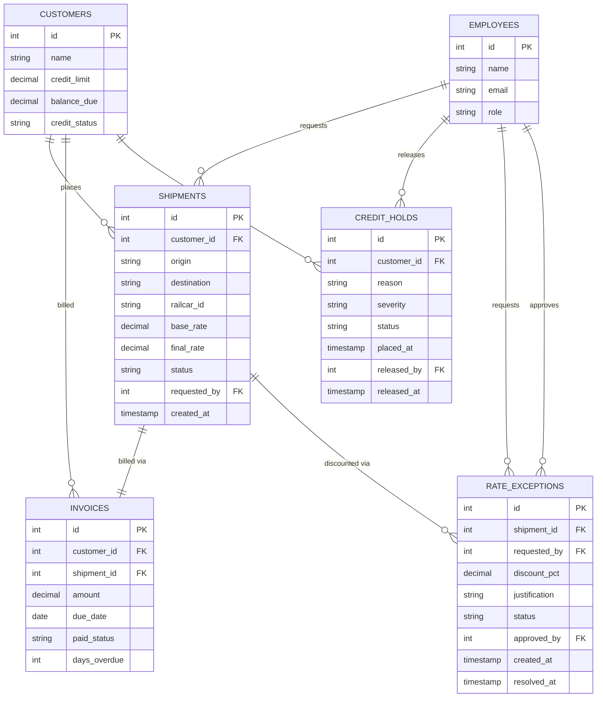

# Swiftrail Logistics -- Credit Hold & Rate Exception MCP Server

## The company

Swiftrail Logistics is a rail-freight carrier moving bulk and containerized
cargo between ports, industrial yards, and inland depots. Sales reps take
shipment requests and can offer rate discounts within their authority;
finance oversees customer credit and any decision that carries real
financial risk.

## The problem

Before this project, a sales rep who wanted an AI assistant to speed up
day-to-day work (looking up a customer, checking a shipment, drafting a
rate-exception justification) would need either no access at all, or raw
access to the operational database -- which is not an acceptable trade-off:
a model with raw SQL access could leak another customer's balance, approve
an unauthorized discount, or release a shipment to a customer who is
significantly overdue.

Two decisions in this system carry genuine financial risk and must not be
made unilaterally by a sales rep or by an LLM acting alone:

1. **Rate exceptions** -- discounting a shipment's rate beyond a rep's own
   authority (above 15%).
2. **Credit hold releases** -- unblocking a shipment for a customer whose
   account is on a *severe* hold (90+ days overdue, or overdue balance over
   25% of their credit limit).

Both require a **human, specifically a finance_manager**, to explicitly
confirm the action before it takes effect -- which is exactly the kind of
constraint that justifies elicitation, authorization checks independent of
the schema, and a tool set that changes as a session's role changes.

## Database & ERD

Engine: MySQL 8.0+. Full schema, seed data, and engine notes are in
[`db/README.md`](db/README.md).



## How each protocol concern shows up in this problem

| Concern | Where it lives | How it fires |
|---|---|---|
| **Capability negotiation** | `agent/client.py::connect()` | The client declares elicitation + sampling support in `initialize`; `supports()` gates resource/prompt calls on what the server actually declared, instead of assuming. |
| **Notifications** | `mcp_server/tools/auth.py` | `authenticate` switches the session role; when a session becomes `finance_manager`, `list_portfolio_credit_exposure` is added at runtime and `tools/list_changed` fires. Stepping back down removes it again. |
| **Elicitation** | `mcp_server/tools/rate_exception.py`, `mcp_server/tools/credit_hold.py` | Any discount over 15%, or release of a *severe* credit hold, pauses the call with `elicitation/create` and blocks on a real human answer before continuing. |
| **Resources** | `mcp_server/tools/resources_prompts.py` | The credit/discount authority policy is exposed via `resources/read` (`policy://credit-and-discount-authority`) as data to be read, not an action to call. |
| **Prompts** | `mcp_server/tools/resources_prompts.py` | `draft_rate_exception_justification` is a discoverable, parameterized template (`shipment_id`, `discount_pct`, `reason_summary`) for a common task. |
| **Transport** | `mcp_server/server.py` | stdio by default for local development (`python server.py`); Streamable HTTP for a real deployment (`python server.py --http`, serves on `127.0.0.1:8000/mcp`). |
| **Progress tracking** | `mcp_server/tools/portfolio.py::run_portfolio_risk_sweep` | Scores every customer's credit risk and reports progress per customer scanned, instead of leaving the client blocked. |
| **Sampling** | `mcp_server/tools/portfolio.py::run_portfolio_risk_sweep` | After the sweep, `sampling/createMessage` asks the *connected agent's own model* (not the server's) for a narrative risk summary. |
| **Defensive tool design** | `mcp_server/tools/rate_exception.py`, `mcp_server/tools/credit_hold.py` | Typed, `additionalProperties`-free input schemas; idempotency guards (`status != 'pending'`/`'active'`); authorization is re-checked in the handler after any human decision, independent of what the elicitation response says. |

## Comparison note: read-only vs. write, and elicitation

| Tool | Type | Requires elicitation? | Why |
|---|---|---|---|
| `search_customer`, `get_shipment_status`, `list_customer_invoices` | read-only | No | No state change; safe for any authenticated session. |
| `approve_rate_exception` | write | Only above 15% discount | Below 15% is within a sales_rep's own authority; above it is real revenue risk. |
| `release_credit_hold` | write | Only for `severity = severe` | Minor holds are routine; severe holds represent a customer significantly overdue. |
| `authenticate` | write (session state) | No | Changes role, not data; drives which other tools are visible. |
| `run_portfolio_risk_sweep` | write (session state cache aside, read-heavy) | No | Read-only analysis; no elicitation needed even though it's long-running. |

**If a client connects without declaring elicitation support**, the server
still calls `ctx.elicit(...)` -- per the MCP spec, a client that hasn't
declared the capability should reject or auto-decline the request rather
than the server silently proceeding. In practice this means an
above-authority discount or a severe hold release simply cannot complete
against such a client, which is the safe failure mode for this system.

## Running it

```bash
# 1. Database
cd db
mysql -u root -p your_database < schema.sql
mysql -u root -p your_database < seed.sql

# 2. Server (in one terminal)
cd ../mcp_server
python -m venv venv && source venv/Scripts/activate   # Windows Git Bash
pip install -r requirements.txt
python server.py            # stdio, for the agent below
# python server.py --http   # Streamable HTTP, for a remote client

# 3. Agent / demo (in another terminal)
cd ../agent
pip install -r requirements.txt
python demo.py --transport stdio
```

`db.py` reads `DB_HOST` / `DB_USER` / `DB_PASSWORD` / `DB_NAME` from the
environment (see `.env.example`); no credentials are committed.

A full annotated transcript of a real run is in
[`demo/demo_transcript.md`](demo/demo_transcript.md).